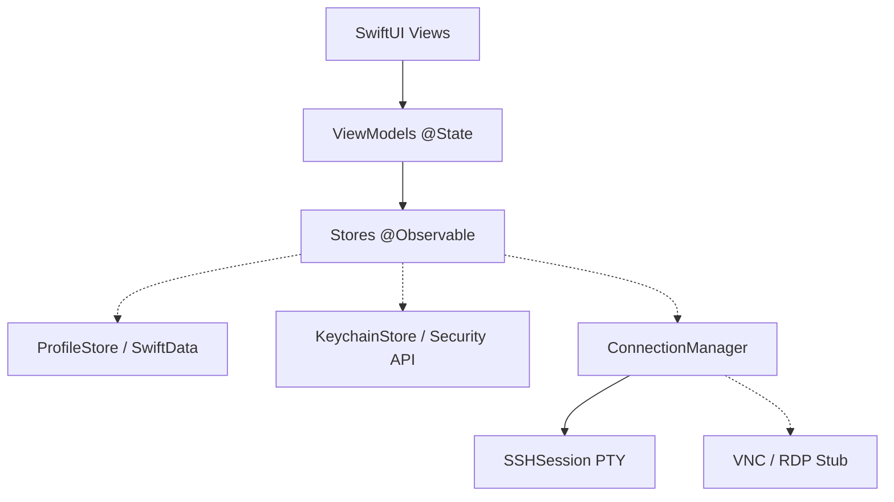

<div align="center">
  
  <h1>RemminaMac</h1>
  <p><b>Enterprise-Grade, Secure Remote Desktop & SSH Client for macOS</b></p>

  <p>
    <a href="https://swift.org"></a>
    <a href="https://apple.com/macos"></a>
    <a href="./LICENSES/"></a>
    <a href="https://github.com/apple/swift-testing"></a>
  </p>
</div>

<br/>

RemminaMac is a powerful, native macOS remote connection manager inspired by the popular Linux tool [Remmina](https://remmina.org/). Built fully in **SwiftUI**, **SwiftData**, and leveraging the **macOS Keychain**, it provides a stunning, secure, and blazing-fast interface for managing remote connections.

---

## ✨ Features

### 🛡️ Secure by Design
- **Keychain Integration:** All passwords are encrypted and stored in the native macOS Keychain (`kSecClassGenericPassword`). No plain-text secrets. ever.
- **SSRF Mitigation:** Advanced network edge-case validation prevents Server-Side Request Forgery by blocking local loopback, cloud metadata (169.254.x.x), and private IP scans.
- **Strict Input Validation:** Command injection protections against shell metacharacters and directory traversal checks on SSH keys.
- **Zero Disk Leakage:** Uses a custom `ssh_askpass` pipe memory workflow so passwords aren't accidentally written to disk or environment variables.

### 🖥️ Core Capabilities
- **Tabbed PTY Sessions:** Open multiple remote SSH terminal sessions concurrently.
- **SwiftData Profiles:** Organize connections efficiently using tags, favorites, and searchable metadata.
- **Visual Design:** A beautifully crafted, responsive sidebar and detail view built entirely in modern SwiftUI.
- **Extensive Logging:** A fully isolated logging ring-buffer captures lifecycle events for easy debugging without leaking sensitive information.

### 🚧 Future Roadmap
- **VNC & RDP Protocol Support** (Architectural stubs currently exist)
- **SFTP Drag-and-Drop File Browser**
- **Cloud Sync**

---

## 🚀 Getting Started

### Prerequisites

- **macOS 14 Sonoma** (or later)
- **Xcode 15** (or later)
- **Swift 5.9+ Toolchain**

### Installation

1. **Clone the repository:**
   ```bash
   git clone https://github.com/YOUR_USERNAME/remmina-mac.git
   cd remmina-mac
   ```

2. **Build the project:**
   Using the Swift CLI:
   ```bash
   swift build
   ```
   Or simply open `Package.swift` in Xcode.

3. **Run the App:**
   ```bash
   swift run RemminaMac
   ```
   Or select the `RemminaMac` scheme in Xcode and press <kbd>⌘</kbd> + <kbd>R</kbd>.

---

## 🧪 Testing

RemminaMac is backed by an extensive, robust test suite (139 passing tests) ensuring absolute reliability in production. Our test matrix covers deep SSRF injection bypasses, edge-case UI state roundtripping, keychain boundaries, and stress-tested internal buffers.

Run the test suite via:
```bash
swift test
```

---

## 🏗 Architecture

RemminaMac employs a strict **MVVM** and Data-Store architecture to clearly separate side-effects from UI logic.



---

## ⌨️ Keyboard Shortcuts

Power users love shortcuts. Navigate RemminaMac without touching your mouse:

| Shortcut | Action |
|----------|--------|
| <kbd>⌘</kbd> + <kbd>N</kbd> | New Profile |
| <kbd>⌘</kbd> + <kbd>F</kbd> | Focus Search Bar |
| <kbd>⌘</kbd> + <kbd>R</kbd> | Reconnect Active Session |
| <kbd>⌘</kbd> + <kbd>⇧</kbd> + <kbd>W</kbd> | Disconnect Active Session |
| <kbd>⌘</kbd> + <kbd>W</kbd> | Close Window |

---

## 🤝 Contributing

Contributions are what make the open source community such an amazing place to learn, inspire, and create. Any contributions you make are **greatly appreciated**.

1. Fork the Project
2. Create your Feature Branch (`git checkout -b feature/AmazingFeature`)
3. Commit your Changes (`git commit -m 'Add some AmazingFeature'`)
4. Push to the Branch (`git push origin feature/AmazingFeature`)
5. Open a Pull Request

## 📄 License

Distributed under the MIT License. See `LICENSES` for more information.
