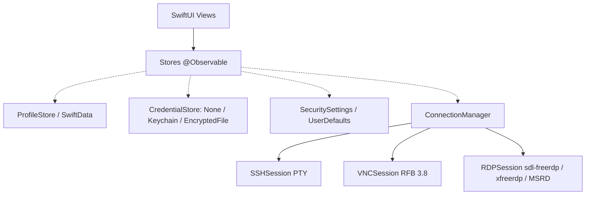

<div align="center">
  
  <h1>RemminaMac</h1>
  <p><b>A Native, Secure SSH, VNC, and RDP Connection Client for macOS</b></p>

  <p>
    <a href="https://swift.org"></a>
    <a href="https://apple.com/macos"></a>
    <a href="./LICENSE"></a>
    <a href="#"></a>
    <a href="https://github.com/Stormbringer-v1/remmina-mac/actions/workflows/build-test.yml"></a>
  </p>
</div>

<br/>

RemminaMac is a powerful, native macOS remote connection manager inspired by the popular Linux tool [Remmina](https://remmina.org/). Built fully in **SwiftUI** and **SwiftData**, it provides a stunning, secure, and blazing-fast interface for managing remote connections, with opt-in credential storage rather than a hidden default backend.

> [!WARNING]
> **This is a 0.9.0 beta and is not production ready.** SSH, VNC, and RDP
> connections have not yet been verified end to end against live servers, and
> the automated suite is currently intermittent. Use it against hosts you can
> afford to have a bad session with, and expect rough edges.

> **Note:** RemminaMac is an independent project and is **not** affiliated with, sponsored by, or endorsed by the Remmina project. The name reflects shared inspiration only.

---

## ✨ Features

### 🛡️ Secure by Design
- **Credential Storage (opt-in, defaults to none):** `SecuritySettings.credentialBackend` defaults to `.none` — a `NullCredentialStore` that persists nothing. SSH keeps working via SSH keys / `ssh-agent` with no backend at all. VNC and RDP need a saved password for their own protocol auth, so opt into one under Settings → Security → Credential Storage: the native macOS Keychain (`kSecClassGenericPassword`, iCloud Keychain sync explicitly opted out) or a portable AES-256-GCM-encrypted file (key derived with PBKDF2-HMAC-SHA256, 600,000 iterations) at `~/Library/Application Support/RemminaMac/credentials.enc`, unlocked with a passphrase you enter once per app run. No plain-text secrets either way.
- **Hostname Validation:** Link-local addresses (169.254.0.0/16, fe80::/10 — including cloud metadata endpoints and IPv4-mapped IPv6), the zero address (0.0.0.0), encoded-IP notation (octal, hex, decimal, percent-encoded), shell metacharacters, control characters, and scheme-prefixed input (`http://`, `file://`, etc.) are always rejected before any connection is attempted. Loopback and RFC 1918 private ranges are allowed by default — this is a client you point at hosts you choose, not a server guarding against SSRF — though the validator has opt-in flags for both; no setting in the app currently exposes them.
- **Strict Input Validation:** Shell metacharacters in host fields and control characters in profile names are rejected. SSH key paths are validated with symlink-chain resolution and a dangerous-prefix allowlist.
- **In-Memory Password Delivery:** SSH and RDP credentials are written directly to the PTY in response to the server's `Password:` prompt. There is no askpass helper script, no on-disk artifact, and no `ps aux` leak. The previous askpass-pipe approach was retired because `/usr/bin/ssh` closes inherited file descriptors above 2 at startup before spawning the helper.
- **Safe-by-Default Remote Content:** Remote → local clipboard writes (SwiftTerm OSC 52, VNC `ServerCutText`) and remote → local URL opening are **off by default** and can be turned on per-user via Settings → Security.

### 🖥️ Core Capabilities
- **SSH Terminal:** Tabbed PTY sessions with real-time PTY password delivery, no on-disk password artifacts, and bounded output buffers per session.
- **VNC Support (Experimental):** A native RFB 3.8 client implementation supporting Raw and CopyRect encodings, DES authentication, mouse/keyboard inputs, and server-bounded framebuffer parsing. VNC authentication is the classic DES challenge sent over a plain, unencrypted TCP socket — tunnel it over SSH on any network you don't fully trust. When idle, the client sends a periodic liveness probe instead of assuming the connection is dead. Tight/CoRRE/ZRRE encodings and reverse connections are not implemented yet.
- **RDP Integration (Experimental):** Prefers a locally installed native SDL FreeRDP client (`sdl-freerdp` / `sdl-freerdp3`, from `brew install freerdp`) over the X11 `xfreerdp`, with PTY prompt-detection for password delivery; hands off to the Microsoft Remote Desktop URL scheme when no FreeRDP client is found. Not verified against live RDP servers.
- **SwiftData Profiles:** Organize connections efficiently using tags, favorites, and searchable metadata.
- **Visual Design:** A beautifully crafted, responsive sidebar and detail view built entirely in modern SwiftUI.
- **Extensive Logging:** A fully isolated logging ring-buffer captures lifecycle events for easy debugging without leaking sensitive information.

### 🚧 Future Roadmap
- **Enhanced VNC & RDP Capabilities** (e.g., support for more encodings, embedded RDP engine, etc.)
- **SFTP Drag-and-Drop File Browser**
- **Cloud Sync**

---

## 🚀 Getting Started

### Prerequisites

- **macOS 14 Sonoma** (or later)
- **Xcode 16.3** (or later) — CI (`.github/workflows/build-test.yml`) checks
  the installed toolchain and fails the build below Swift 6.1
- The test target uses Swift Testing, which needs Swift 6.0+; the actual
  floor is 6.1, since SwiftTerm 1.10.1's own `Package.swift` uses a
  trailing-comma argument list (SE-0439) that only parses on Swift 6.1+

### Installation

1. **Clone the repository:**
   ```bash
   git clone https://github.com/Stormbringer-v1/remmina-mac.git
   cd remmina-mac
   ```

2. **Build the project:**
   Using the Swift CLI:
   ```bash
   swift build
   ```
   Or simply open `Package.swift` in Xcode.

3. **Run the App:**
   ```bash
   swift run RemminaMac
   ```
   Or select the `RemminaMac` scheme in Xcode and press <kbd>⌘</kbd> + <kbd>R</kbd>.

   `swift run` is convenient for development, but it runs the binary directly
   rather than as a bundled macOS application — there is no icon, no Dock
   identity, and the app cannot be launched from Finder or Spotlight.

### Installing as a real macOS app

To build a proper `.app` bundle and install it:

```bash
./build_app.sh
cp -r dist/RemminaMac.app /Applications/
```

`build_app.sh` compiles a release binary, assembles the bundle, generates the
icon set from `Resources/AppIcon.png`, applies the entitlements, stamps the
build number from the commit count, and ad-hoc code signs the result. It
prints the version it produced, for example `Version: 0.9.0 (build 38)`.

> [!IMPORTANT]
> **First launch will be blocked by Gatekeeper.** The bundle is ad-hoc signed,
> not signed with an Apple Developer ID and not notarized, so macOS refuses to
> open it normally. To run it anyway, either right-click the app and choose
> **Open** (then confirm), or clear the quarantine flag:
> ```bash
> xattr -dr com.apple.quarantine /Applications/RemminaMac.app
> ```
> A consequence of ad-hoc signing is that the code identity changes on every
> build, so macOS treats each build as a different application. If you've
> opted into the macOS Keychain as your credential backend (Settings →
> Security → Credential Storage — the default backend stores nothing at
> all), this means macOS will prompt for Keychain access again after an
> update.

### 🔑 SSH Keys and Passphrases

- Unencrypted keys, and keys already loaded into `ssh-agent`, work as-is —
  RemminaMac shells out to `/usr/bin/ssh` with `-i <key>` and leaves your
  agent's socket untouched.
- Passphrase-protected keys need to be loaded first:
  `ssh-add --apple-use-keychain <key>`. If `ssh` still prompts for a
  passphrase interactively, RemminaMac stops the connection attempt and
  shows that instruction instead of waiting on a prompt it can't answer.
- Host keys are trusted on first use
  (`StrictHostKeyChecking=accept-new`). If a host key later changes, the
  connection is stopped with an error pointing at `~/.ssh/known_hosts`.

---

## 🧪 Testing

RemminaMac is backed by an extensive, robust test suite. Our test matrix covers hostname-validation bypass attempts (encoded IPs, link-local/metadata addresses), edge-case UI state roundtripping, credential-storage boundaries across the Keychain, encrypted-file, and null backends, VNC parser bounds, SSH PTY-write credential delivery, and stress-tested internal buffers.

Run the test suite via:
```bash
swift test
```

---

## 🏗 Architecture

RemminaMac employs a strict **MVVM** and Data-Store architecture to clearly separate side-effects from UI logic.


```mermaid
graph TD
    UI[SwiftUI Views] --> ST[Stores @Observable]
    ST -.-> PS[ProfileStore / SwiftData]
    ST -.-> CS[CredentialStore: None / Keychain / EncryptedFile]
    ST -.-> SS[SecuritySettings / UserDefaults]
    ST -.-> CM[ConnectionManager]
    CM --> SSH[SSHSession PTY]
    CM --> VNC[VNCSession RFB 3.8]
    CM --> RDP[RDPSession sdl-freerdp / xfreerdp / MSRD]
```

---

## ⌨️ Keyboard Shortcuts

Power users love shortcuts. Navigate RemminaMac without touching your mouse:

| Shortcut | Action |
|----------|--------|
| <kbd>⌘</kbd> + <kbd>N</kbd> | New Profile |
| <kbd>⌘</kbd> + <kbd>R</kbd> | Reconnect Active Session |
| <kbd>⌘</kbd> + <kbd>⇧</kbd> + <kbd>W</kbd> | Disconnect Active Session |

<kbd>⌘</kbd> + <kbd>W</kbd> (Close Window) also works — it's the standard
macOS window shortcut, not something this app defines itself. The search
field's placeholder likewise references <kbd>⌘</kbd> + <kbd>F</kbd>, the
standard shortcut macOS gives a toolbar `.searchable` field; there's no
separate `.keyboardShortcut` binding for it in `MainView.swift`.

---

## 🔒 Sandbox & External Tools

The macOS app sandbox is **not enabled** by default. Two architectural realities drive this:

1. **`/usr/bin/ssh` needs to read and write the user's SSH config.** A sandboxed app cannot reach `~/.ssh/config` or `~/.ssh/known_hosts` without per-path entitlements.
2. **RDP integrates with an externally installed FreeRDP client** (`sdl-freerdp` preferred, `xfreerdp` as a fallback). The sandbox blocks spawning of non-bundled, non-system executables on standard paths.

The `Resources/RemminaMac.entitlements` file is included as a forward-looking starting point for users who want to opt into sandbox with appropriate exceptions (for example, a bundled helper tool for the FreeRDP client, and explicit `files.absolute-path.read-write` exceptions for `~/.ssh`). The build script applies this file via `codesign --entitlements` so what you ship matches the file on disk.

Keychain access is independent of the sandbox — the `keychain-access-groups` entry declares the credential namespace regardless — but it's only exercised at all when the macOS Keychain is the selected credential backend (Settings → Security → Credential Storage; the default backend stores nothing).

## 🤝 Contributing

Contributions are what make the open source community such an amazing place to learn, inspire, and create. Any contributions you make are **greatly appreciated**.

1. Fork the Project
2. Create your Feature Branch (`git checkout -b feature/AmazingFeature`)
3. Commit your Changes (`git commit -m 'Add some AmazingFeature'`)
4. Push to the Branch (`git push origin feature/AmazingFeature`)
5. Open a Pull Request

## 📄 License

Distributed under the MIT License — see [`LICENSE`](./LICENSE) for the full
text. Third-party framework and dependency licenses (Apple system
frameworks, SwiftTerm) are listed in [`LICENSES/README.md`](./LICENSES/README.md).
