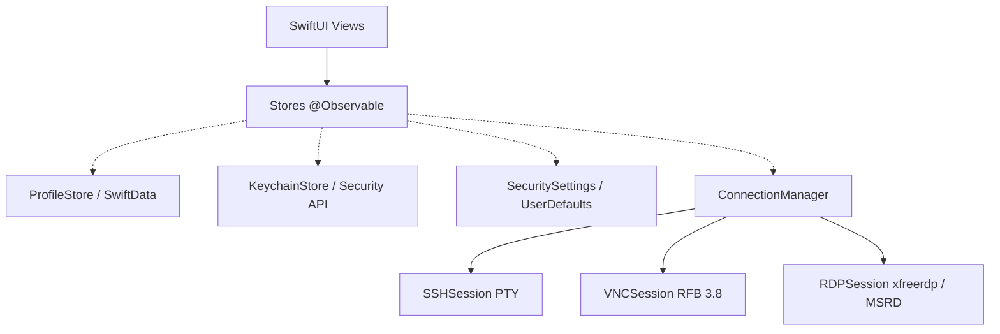

<div align="center">
  
  <h1>RemminaMac</h1>
  <p><b>A Native, Secure SSH, VNC, and RDP Connection Client for macOS</b></p>

  <p>
    <a href="https://swift.org"></a>
    <a href="https://apple.com/macos"></a>
    <a href="./LICENSES/"></a>
    <a href="#"></a>
    <a href="https://github.com/Stormbringer-v1/remmina-mac"></a>
  </p>
</div>

<br/>

RemminaMac is a powerful, native macOS remote connection manager inspired by the popular Linux tool [Remmina](https://remmina.org/). Built fully in **SwiftUI**, **SwiftData**, and leveraging the **macOS Keychain**, it provides a stunning, secure, and blazing-fast interface for managing remote connections.

> [!WARNING]
> **This is a 0.9.0 beta and is not production ready.** SSH, VNC, and RDP
> connections have not yet been verified end to end against live servers, and
> the automated suite is currently intermittent. Use it against hosts you can
> afford to have a bad session with, and expect rough edges.

> **Note:** RemminaMac is an independent project and is **not** affiliated with, sponsored by, or endorsed by the Remmina project. The name reflects shared inspiration only.

---

## ✨ Features

### 🛡️ Secure by Design
- **Keychain Integration:** All passwords are encrypted and stored in the native macOS Keychain (`kSecClassGenericPassword`). No plain-text secrets. ever. iCloud Keychain sync is explicitly opted out.
- **SSRF Mitigation:** Hostname validation blocks local loopback, cloud metadata (169.254.x.x), and (when opted in) private IP ranges. Encoded-IP notation (octal, hex, decimal, URL-encoded) is rejected before any connection is attempted.
- **Strict Input Validation:** Shell metacharacters in host fields and control characters in profile names are rejected. SSH key paths are validated with symlink-chain resolution and a dangerous-prefix allowlist.
- **In-Memory Password Delivery:** SSH and RDP credentials are written directly to the PTY in response to the server's `Password:` prompt. There is no askpass helper script, no on-disk artifact, and no `ps aux` leak. The previous askpass-pipe approach was retired (see `PROBLEMS.md` P0-1) because `/usr/bin/ssh` closes inherited file descriptors above 2 at startup before spawning the helper.
- **Safe-by-Default Remote Content:** Remote → local clipboard writes (SwiftTerm OSC 52, VNC `ServerCutText`) and remote → local URL opening are **off by default** and can be turned on per-user via Settings → Security.

### 🖥️ Core Capabilities
- **SSH Terminal:** Tabbed PTY sessions with real-time PTY password delivery, no on-disk password artifacts, and bounded output buffers per session.
- **VNC Support (Experimental):** A native RFB 3.8 client implementation supporting Raw and CopyRect encodings, DES authentication, mouse/keyboard inputs, and server-bounded framebuffer parsing. Tight/CoRRE/ZRRE encodings and reverse connections are not implemented yet.
- **RDP Integration (Experimental):** Launches a local `xfreerdp` (FreeRDP) with PTY prompt-detection for password delivery, or hands off to the Microsoft Remote Desktop URL scheme when `xfreerdp` is not installed.
- **SwiftData Profiles:** Organize connections efficiently using tags, favorites, and searchable metadata.
- **Visual Design:** A beautifully crafted, responsive sidebar and detail view built entirely in modern SwiftUI.
- **Extensive Logging:** A fully isolated logging ring-buffer captures lifecycle events for easy debugging without leaking sensitive information.

### 🚧 Future Roadmap
- **Enhanced VNC & RDP Capabilities** (e.g., support for more encodings, embedded RDP engine, etc.)
- **SFTP Drag-and-Drop File Browser**
- **Cloud Sync**

---

## 🚀 Getting Started

### Prerequisites

- **macOS 14 Sonoma** (or later)
- **Xcode 16** (or later, ships with Swift 6.0)
- The test target uses Swift Testing, which requires Swift 6.0+

### Installation

1. **Clone the repository:**
   ```bash
   git clone https://github.com/Stormbringer-v1/remmina-mac.git
   cd remmina-mac
   ```

2. **Build the project:**
   Using the Swift CLI:
   ```bash
   swift build
   ```
   Or simply open `Package.swift` in Xcode.

3. **Run the App:**
   ```bash
   swift run RemminaMac
   ```
   Or select the `RemminaMac` scheme in Xcode and press <kbd>⌘</kbd> + <kbd>R</kbd>.

---

## 🧪 Testing

RemminaMac is backed by an extensive, robust test suite. Our test matrix covers deep SSRF injection bypasses, edge-case UI state roundtripping, keychain boundaries, VNC parser bounds, SSH PTY-write credential delivery, and stress-tested internal buffers.

Run the test suite via:
```bash
swift test
```

---

## 🏗 Architecture

RemminaMac employs a strict **MVVM** and Data-Store architecture to clearly separate side-effects from UI logic.


```mermaid
graph TD
    UI[SwiftUI Views] --> ST[Stores @Observable]
    ST -.-> PS[ProfileStore / SwiftData]
    ST -.-> KS[KeychainStore / Security API]
    ST -.-> SS[SecuritySettings / UserDefaults]
    ST -.-> CM[ConnectionManager]
    CM --> SSH[SSHSession PTY]
    CM --> VNC[VNCSession RFB 3.8]
    CM --> RDP[RDPSession xfreerdp / MSRD]
```

---

## ⌨️ Keyboard Shortcuts

Power users love shortcuts. Navigate RemminaMac without touching your mouse:

| Shortcut | Action |
|----------|--------|
| <kbd>⌘</kbd> + <kbd>N</kbd> | New Profile |
| <kbd>⌘</kbd> + <kbd>F</kbd> | Focus Search Bar |
| <kbd>⌘</kbd> + <kbd>R</kbd> | Reconnect Active Session |
| <kbd>⌘</kbd> + <kbd>⇧</kbd> + <kbd>W</kbd> | Disconnect Active Session |
| <kbd>⌘</kbd> + <kbd>W</kbd> | Close Window |

---

## 🔒 Sandbox & External Tools

The macOS app sandbox is **not enabled** by default. Two architectural realities drive this:

1. **`/usr/bin/ssh` needs to read and write the user's SSH config.** A sandboxed app cannot reach `~/.ssh/config` or `~/.ssh/known_hosts` without per-path entitlements.
2. **RDP integrates with an externally installed `xfreerdp`** (FreeRDP). The sandbox blocks spawning of non-bundled, non-system executables on standard paths.

The `Resources/RemminaMac.entitlements` file is included as a forward-looking starting point for users who want to opt into sandbox with appropriate exceptions (for example, a bundled helper tool for `xfreerdp`, and explicit `files.absolute-path.read-write` exceptions for `~/.ssh`). The build script applies this file via `codesign --entitlements` so what you ship matches the file on disk.

Keychain access is independent of the sandbox — the `keychain-access-groups` entry declares the credential namespace regardless.

## 🤝 Contributing

Contributions are what make the open source community such an amazing place to learn, inspire, and create. Any contributions you make are **greatly appreciated**.

1. Fork the Project
2. Create your Feature Branch (`git checkout -b feature/AmazingFeature`)
3. Commit your Changes (`git commit -m 'Add some AmazingFeature'`)
4. Push to the Branch (`git push origin feature/AmazingFeature`)
5. Open a Pull Request

## 📄 License

Distributed under the MIT License. See `LICENSES` for more information.
